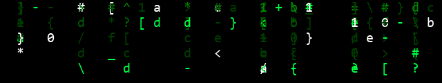

<div align="center">

<pre>
     _            _               _____ _   _            
    | |          | |             |____ | | | |           
  __| | __ _ _ __| | ___ __ ___      / / |_| |_ ___ _ __ 
 / _` |/ _` | '__| |/ / '_ ` _ \     \ \__| __/ _ \ '__|
| (_| | (_| | |  |   <| | | | | |.___/ / |_| ||  __/ |   
 \__,_|\__,_|_|  |_|\_\_| |_| |_|\____/ \__|\ __\___|_|   
</pre>

**`~ $ whoami`** → Marcos · <!-- AGE_START -->21<!-- AGE_END --> años · 🇭🇳 Honduras

[](mailto:mygcubas123@gmail.com)

[](https://www.npmjs.com/~darkm3tter)

</div>



---

## [~/sobre-mi]

<pre>
~ $ cat sobre-mi.txt
</pre>

```
🎂  Nacido el 06/06/2005 — mi edad se actualiza sola en este README
💻  Desarrollador full-stack construyendo herramientas OSS para el día a día del programador
🥁  Baterista — la música es mi otra forma de crear ritmo y estructura
🤖  Apasionado por la Inteligencia Artificial y su aplicación en herramientas de desarrollo
🔐  Incursionando en el mundo de la Ciberseguridad — especialmente seguridad de cadena de suministro
🛠️  TypeScript estricto, tests primero y Conventional Commits
🌐  Documentación bilingüe (EN/ES) en todos mis proyectos
```

---

## [~/stack]

<pre>
~ $ cat stack.txt
</pre>


### 🔐 Aprendiendo


### 🤖 IA & Herramientas


---

## [~/proyectos]

<pre>
~ $ ls -la proyectos
</pre>

| Proyecto | Qué es | Estado |
|---|---|---|
| [**depdiet**](https://github.com/darkm3tter/depdiet) | Detecta dependencias TS/JS tan poco usadas que conviene inlinear o eliminar, con score transparente y modo CI |    [npm](https://www.npmjs.com/package/depdiet) |
| [**installprobe**](https://github.com/darkm3tter/installprobe) | Investigación educativa de cadena de suministro: qué ejecuta `npm install` en tu máquina y hasta dónde llega un paquete malicioso |    [npm](https://www.npmjs.com/package/installprobe) |

---

## [~/pasiones]

<pre>
~ $ cat pasiones.log
</pre>

<table>
  <tr>
    <td align="center" width="33%">
      <h3>🥁 Batería</h3>
      <p>La música es mi escape creativo. Tocar batería me enseñó disciplina, ritmo y a mantener todo sincronizado — igual que en el código.</p>
    </td>
    <td align="center" width="33%">
      <h3>🤖 Inteligencia Artificial</h3>
      <p>Uso IA como copiloto en mi flujo de desarrollo. Me fascina cómo los LLMs están transformando la forma en que construimos software.</p>
    </td>
    <td align="center" width="33%">
      <h3>🔐 Ciberseguridad</h3>
      <p>Estoy incursionando en el mundo de la ciberseguridad, con especial interés en la seguridad de cadena de suministro y la protección del ecosistema npm.</p>
    </td>
  </tr>
</table>

---

## [~/stats]

<pre>
~ $ neofetch
</pre>

<div align="center">


</div>

---

## [~/contacto]

<pre>
~ $ cat contacto.txt
</pre>

<div align="center">

[](mailto:mygcubas123@gmail.com)
[](https://github.com/darkm3tter)

</div>

---

<pre>
░▒▓░▒▓░▒▓░▒▓░▒▓░▒▓░▒▓░▒▓░▒▓░▒▓░▒▓░▒▓░▒▓░▒▓░▒▓░▒▓░▒▓░▒▓░▒▓░▒▓░▒▓░▒▓░▒▓░▒▓░▒▓░▒▓░▒▓░▒▓░▒▓░▒▓░▒▓░▒▓░▒▓░▒▓░▒▓
</pre>

<div align="center">

<pre>
~ $ exit
</pre>

*TypeScript estricto · tests primero · Conventional Commits · 🥁 · 🤖 · 🔐*


</div>
